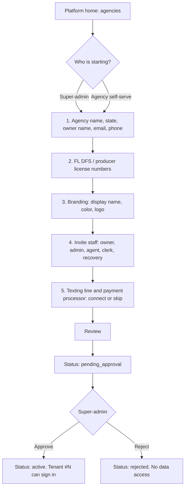
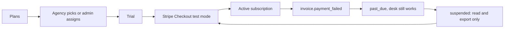
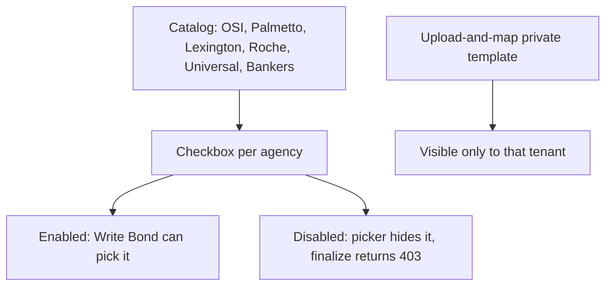
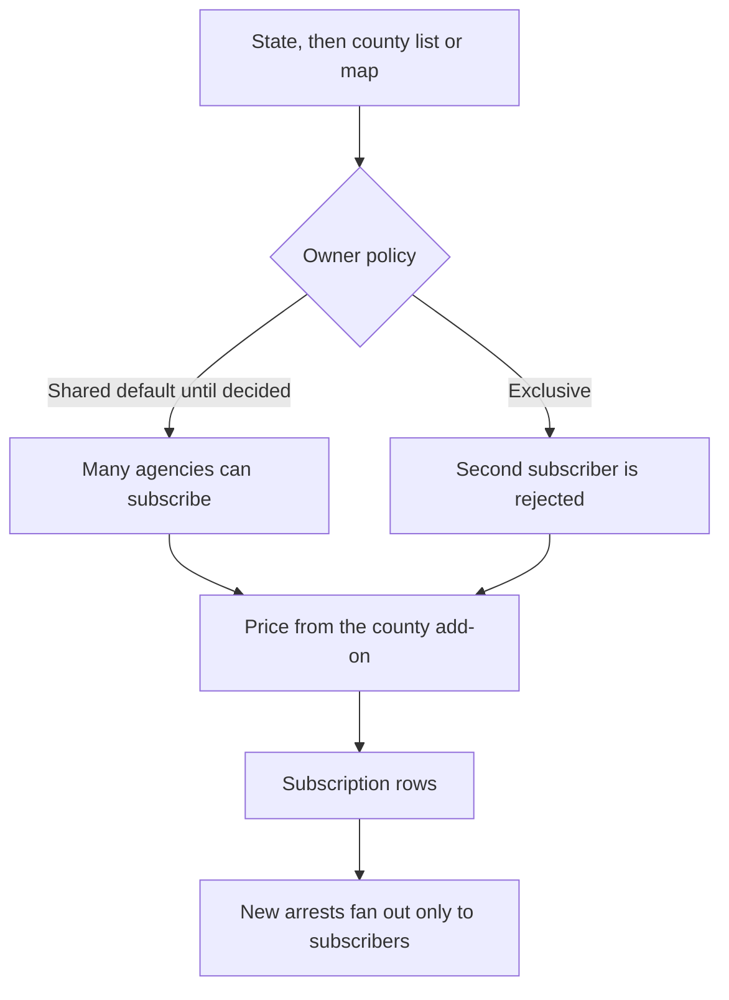
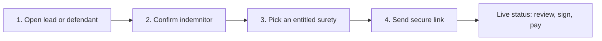

# ShamrockLeads — Multi-tenant SaaS architecture

> **Status:** Phase 1 foundation is in this repo, behind `SAAS_MULTI_TENANT` (default **off**).
> **Tenant #1:** Shamrock Bail Bonds, Fort Myers, FL (`tenant_id = shamrock`).
> **Product line:** from jail roster to paid, signed, power-allocated, court-watched, GPS-checked bond, for more than one agency.
> **Peers this is aimed at:** Captira, eBail, BailBooks, Simply Bail, BondWare, plus the isolation claims from BailSafe Pro and BailTrack.
> **Verified against:** application code at the time of this document. Live Atlas was not queried. No production data was changed.

This document is the plan. The code that lands with it does not turn the flag on, does not connect to production, and does not edit `deploy-hetzner.yml` or secrets.

---

## 1. Recommendation

Use **one shared MongoDB database** (`ShamrockBailDB`, the database `get_db()` already opens) with **`tenant_id` on every tenant-owned document**, and keep an explicit **global allowlist** for data that is not an agency's book.

A database-per-tenant model does not fit this stack. There is one Motor client in `dashboard/extensions.py`, one `MONGODB_DB_NAME`, and one Atlas budget that is already treated as tight (`dashboard/routers/data_retention.py` plans around a 512 MB ceiling). The scraper fleet writes the public roster **once** through `writers/mongo_writer.py`. Copying that write into N databases would multiply load on county sites and on Atlas, and it would make platform health queries (scraper status, source performance) N round-trips. Peers that advertise "isolation at the database layer" can still be matched with a shared database if every agency query is physically incapable of omitting `tenant_id`. That is a chokepoint problem, not a cluster-count problem.

The hybrid escape hatch is reserved, not built. `tenants.db_name` may later point one large agency at its own database while the same `get_collection()` proxy is aimed at that handle. No agency gets a private database in phase 1. Shamrock stays on the shared database so daily operations do not move.

**Do not enable `SAAS_MULTI_TENANT` until the backfill in `scripts/backfill_tenant_id.py` has been applied by a human.** With the flag on, tenant-owned queries require `tenant_id`. Documents that have not been stamped disappear from Shamrock's screens. That is fail-closed, and it is also an outage if it happens before the stamp.

---

## 2. What the 2026-10-07 competitive pass got right

Checked in this tree, not taken from the memo.

| Claim | What the code shows |
|---|---|
| No tenant scoping | Confirmed before this change. No module path contained `tenant`. `get_collection()` returned `get_db()[name]` with no filter. |
| "0 of 122 collections" | **118** known application collections (`dashboard/tenancy/inventory.py` scans `get_collection`, `db["…"]`, `db.name.find`, collection constants, and cron `_idx`). Tests and one-off scripts are excluded. **11** are the global allowlist; the other **107** known names are tenant-owned, including `family_relationships`, `persons`, `osint_scans`, `docket_events`, and the surety template files and versions. `tenant_memberships` is platform, not part of that 118. Names that are not on the global or platform lists, including names nobody has inventoried, are tenant-owned too, and a connected backfill stamps those live collections as well. The memo's "15 global + 86 tenant" split was not a checked-in list. A shorter allowlist is the safer reading. |
| 18 direct `MongoClient` files | **19** constructors outside `dashboard/extensions.py`: 16 `pymongo.MongoClient` call sites and 3 other `AsyncIOMotorClient`s (`social/main.py`, `scripts/create_indexes.py`, `scripts/verify_prod_checklist_pockets.py`). Listed in §12. They are not routed through the chokepoint in this PR. |
| Unique `poa_number` and bond keys | Confirmed. `poa_inventory.poa_number` is unique in `dashboard/extensions.py` and `scripts/mongo_indexes.py`. `gcal_sync.dedup_key`, `paperwork_packets.packet_id`, `payment_plans.plan_id`, `defendants.identity_key`, `defendants.defendant_id` are unique in `dashboard/cron.py`, which runs on dashboard boot. Bond case id is indexed, not globally unique, in `dashboard/main.py`. Specs for `(tenant_id, …)` live in `dashboard/tenancy/indexes.py` and are **not** created on boot. |
| Requests without a tenant fail closed | Implemented **when the flag is on**. Unknown hosts get HTTP 403 `tenant_required`. A tenant-owned query with no job/request context raises `TenantScopeError`, mapped to the same 403. Flag off never 403s for this reason. |
| Audit TTL is 90 days | Confirmed. `dashboard/cron.py` creates `idx_audit_ttl_90d` with `expireAfterSeconds=7776000`. `scripts/mongo_indexes.py` creates `idx_ttl_90d` with `90 * 24 * 3600`. The trust pack wants **7 years** for money, signature, and POA actions (`AUDIT_RETENTION_TARGET_SECONDS`). This PR does not drop the TTL. Boot would recreate it. |
| `leads` already mentions `tenant_id` | Confirmed, and it does **not** isolate anything. `writers/mongo_writer.py` builds a unique index `(arrest_id, tenant_id)` named `dedup_lead`. Writers do not set `tenant_id`, and readers do not filter on it. |
| No Stripe / signup | True at the start of this work. Premiums still go through SwipeSimple. Signup and Stripe Billing now exist behind `SAAS_MULTI_TENANT`, test mode only, and are absent from the request path while the flag is off. |
| Portal `mongo-proxy` | **Not in this repo.** `shamrock-bail-portal-site/cloud-functions/mongo-proxy/index.js` was not modified and was not re-read here. The memo and the owner describe a shared-API-key function that runs caller-supplied find/update/delete against any database and collection. Replacement plan is §10. That repository stays untouched. |

Roles today, from `dashboard/auth/pin_middleware.py`: `god_admin`, `admin` / `staff`, `sub_agent` (whitelist in `sub_agents`), `recovery` (allowlist in `dashboard/auth/recovery_scope.py`). The platform super-admin email is hardcoded in `dashboard/auth/super_admin.py` as `admin@shamrockbailbonds.biz`. There is no per-agency user directory.

---

## 3. Tenancy model

### 3.1 Documents

| Collection | Who can read it | Document |
|---|---|---|
| `tenants` | Platform scope only | One agency. `tenant_id` is the slug (`shamrock`). |
| `tenant_memberships` | Platform scope only | Email + role inside one tenant. |

Shapes are `shamrock_tenant_document()` and `shamrock_owner_membership()` in `dashboard/tenancy/model.py`. App startup does **not** insert them. The backfill script's apply path upserts them. Until that human step, the collections do not need to exist: flag off never reads them.

`tenant_id` values are slugs: `^[a-z][a-z0-9_]{1,48}$`. Shamrock's id is the string `shamrock`, not an ObjectId, so logs and exports stay readable and the backfill is a single stamp.

### 3.2 Global vs tenant-owned

**Global (allowlist, `GLOBAL_COLLECTIONS`).** Shared because the platform scrapes them once, or because they are reference data / process health, not an agency's book.

- `arrests` — public jail-roster facts. Dedup stays `(state, county, booking_number)` in `writers/mongo_writer.py`.
- `scraper_status`, `scraper_config`, `scraper_run_log`, `scraper_triggers`, `ingestion_log`, `custody_rechecks` — scraper operations.
- `error_log`, `alpr_worker_status`, `source_performance` — platform health.
- `zip_lookups` — reference.

**Tenant-owned.** Everything else, including leads an agency claims or is subscribed to, defendants it works, indemnitors, matches, `active_bonds` / `bond_cases`, POA inventory, paperwork packets, payments, payment plans, court reminders, check-ins, GPS rows, outreach, `sub_agents`, notifications, audit events, recovery shares, Sheets/sync cursors, and branding/settings.

A defendant is **not** a global person. Two agencies bonding the same human get two defendant rows. Sharing a person graph would share phone numbers, addresses, and indemnitors across companies. That violates the product rule that PII is tenant-owned.

`leads` is tenant-owned even though the writer currently inserts it from the global scrape. Delivery into `leads` becomes a fan-out from a global `arrests` row to the agencies subscribed to that county (§8 and the lead-subscription console). Until that ships, flag off keeps today's writer behavior: one unscoped `leads` collection for Shamrock.

**Platform collections** (`tenants`, `tenant_memberships`) are not on the global allowlist. A normal request that calls `get_collection("tenants")` fails closed. A platform job (`bind_platform_job`) may read them. A platform job may **not** read `active_bonds`; scrapers run in that mode on purpose.

### 3.3 Chokepoint

```text
get_collection(name)  ->  get_db()[name]
                              |
                              | flag off: raw Motor collection
                              | flag on + global name: raw Motor collection
                              | flag on + anything else: TenantScopedCollection
```

`dashboard/extensions.py` is the only place this decision lives. `db.collection_name` attribute access and `db.get_collection(name)` go through the same proxy (`TenantScopedDatabase`) when the flag is on.

The proxy, when enforced:

- Injects `tenant_id` into `find`, `find_one`, `update_*`, `delete_*`, `count_documents`, `distinct`, `find_one_and_*`, and the front of `aggregate`.
- Rejects a filter or `$set` / `$unset` that names a different `tenant_id`, including inside `$or`.
- Rejects `$where`, `$function`, `$accumulator`, aggregation `$out` / `$merge`, and `bulk_write`.
- Replaces `estimated_document_count` with a scoped `count_documents` so a count cannot leak another agency's volume.
- Stamps `tenant_id` on `insert_one` / `insert_many` / `replace_one`. The caller's document is the one that gets the field, so API responses see it.

Flag off: the proxy is not installed. `get_collection` returns the same Motor object it returned before this change. Filters are not rewritten. Inserts do not gain a field.

The tested route slice is the notification center (`dashboard/routers/notifications.py`). Every other `get_collection` caller becomes scoped on the day the flag is turned on, without a second edit. The bypass list in §12 is the work that must land **before** that day, because those clients never call `get_collection`.

---

## 4. Tenant resolution

Implemented in `dashboard/tenancy/context.py`. The contextvar is the only tenant id the proxy trusts. Hand-written filters cannot override it.

| Signal | Flag off | Flag on |
|---|---|---|
| Any host, any header | `shamrock` | — |
| `*.shamrockbailbonds.biz` except the app suffix, plus `leads.`, `paperwork.`, localhost, the VPS IP, `testserver` | `shamrock` | `shamrock` for an anonymous caller (webhooks, machine auth). A signed-in caller must have an active `tenant_memberships` row for that tenant. Session slug is ignored unless it is `shamrock` or the caller is a platform super-admin. |
| `{slug}.app.shamrockbailbonds.biz` | `shamrock` | that slug **only** when the signed-in email has an active membership in it. The host is routing input. No membership, or a membership in a different agency, is **403** `tenant_required`. |
| `X-Tenant-Id` | ignored | honored only when the signed session is `god_admin` or `admin` **and** the email is `admin@shamrockbailbonds.biz`. This is impersonation, not host selection. |
| Anything else | `shamrock` | **403** `tenant_required` |

Login does not take a tenant from the browser. `_sign_token` stamps `tenant_id: shamrock`. Cookies signed before this change have no field; `_attach_session` treats that as Shamrock, so nobody is logged out.

Customer custom domains are a later lookup on `tenants.custom_domains`. Until that table is live, an unknown host fails closed instead of falling through to Shamrock. That is why Shamrock's real hostnames are listed explicitly.

Middleware is pure ASGI and is registered **inside** PIN auth (`dashboard/main.py` adds it before `PinAuthMiddleware`, and Starlette runs the last `add_middleware` first). The signed session is already on `scope["state"]` when the tenant is chosen. Webhooks on `leads.shamrockbailbonds.biz` resolve to Shamrock by host, so DocuSeal, Twilio, and BlueBubbles keep a tenant when the flag is on. They still need the backfill first, or they will not see old rows.

Dashboard boot (`run_startup_database_tasks`) seeds POA inventory and verifies core indexes inside `bind_job_tenant("shamrock")`. With the flag on, those calls would otherwise hit the tenant proxy before any request or job context exists, raise `tenant_required`, and the helpers would swallow that and skip the work. Flag off, the proxy is not installed, so the bind does not stamp `tenant_id` onto the seed.

Background jobs:

- Dashboard crons (`dashboard/cron.py` `_cron_runner`) call `bind_job_tenant("shamrock")` around the enablement check and the job body. Flag off, queries stay raw. Flag on, crons keep serving tenant #1 until a per-tenant fan-out exists.
- Scraper executions (`core/scheduler.py` `_run_scraper`) call `bind_platform_job`. They write global `arrests` through `MongoWriter`, which still bypasses the proxy. If scraper code reaches a tenant-owned collection while the flag is on, the proxy rejects it.

---

## 5. Auth and roles

Today's PIN cookie stays the Shamrock door. It is not thrown away.

| Layer | Who | What they can do |
|---|---|---|
| Platform super-admin | `admin@shamrockbailbonds.biz` with `god_admin` / `admin`, while that email also has `tenant_memberships.platform_super_admin` | Onboard agencies, approve signups, set plans, impersonate via `X-Tenant-Id`, see MRR. Cannot read another agency's bonds without an explicit tenant switch, and that switch is the audit event. |
| Tenant owner | Membership role `owner` | Billing, staff invites, surety entitlements, lead subscriptions, integrations. |
| Tenant admin / staff | `admin`, `staff` | The bond desk. Same idea as today's god-admin / staff split, scoped to one tenant. |
| Sub-agent | `sub_agent` | Own book only. `dashboard/auth/agent_scope.py` stays, and gains `tenant_id` so license numbers can repeat across agencies. |
| Recovery | `recovery` | The existing allowlist only, inside one tenant. A recovery cookie never becomes a platform admin. |
| Indemnitor / defendant | Portal token, not a staff session | One booking, one tenant. Magic links stay unguessable; the token row is tenant-owned. |

`sub_agents` documents gain `tenant_id`. The unique key becomes `(tenant_id, license_number)`, specified and not applied. Recovery ids are unique per tenant the same way.

Splitting "Brendan, Shamrock owner" from "Brendan, platform operator" is an owner decision (§15). The code treats the current super-admin email as both until a second platform operator exists.

---

## 6. Per-tenant secrets and integrations

Shamrock's integrations are process environment variables today: DocuSeal (`DOCUSEAL_URL`, `DOCUSEAL_API_KEY`, template ids), SwipeSimple, Slack webhooks, Google credentials, BlueBubbles (`BLUEBUBBLES_URL_0178` / password), Twilio, Telegram, the Wix/GAS bridge. `dashboard/services/surety_registry.py` reads template ids from env. That is correct for one agency and wrong for two.

Future collection `tenant_integrations` (tenant-owned), one document per provider:

```text
tenant_id, provider, status, public_config, secret_ref
```

`secret_ref` is a pointer (`env:SHAMROCK_DOCUSEAL_API_KEY` at first, a secret-manager path later). The secret value is not stored in Mongo and not written to logs. Slack, Sheets, and SMS copies must keep using the redaction filter in `dashboard/logging_redaction.py`.

| Provider | What is per tenant | What stays platform |
|---|---|---|
| DocuSeal | Base URL, API key, webhook secret, which template ids this agency may send | The platform can host one DocuSeal and still isolate by template id |
| Premium collection | SwipeSimple (or a later processor) merchant for **indemnitor** payments | Stripe Billing, below, charges the **agency** for the SaaS. These are different money flows. |
| Texting | BlueBubbles line or Twilio number, consent ledger (`sms_consent_ledger` is tenant-owned and has no TTL) | — |
| Slack / email | That agency's webhook and court inbox | Platform alerts (`#scraper-errors`) stay on the platform webhook |
| Google | That agency's calendar and sheet, if they want one | — |
| Intake | That agency's Wix site, Telegram bot, or hosted form | GAS Web App URL policy does not change for Shamrock. A new agency does not get Shamrock's `/exec` URL. |

Flag off, every service keeps reading Shamrock's env. No secret is moved in this PR.

---

## 7. Surety templates

Paperwork Desk is building upload-and-map onboarding beside this work. Templates have to be tenant-aware when that lands, without a second packet engine.

Two layers:

1. **Platform catalog.** OSI and Palmetto are active in `SURETY_REGISTRY`. Lexington National, Roche, Universal, and Bankers are inactive stubs in the same dict. The catalog row (field map, DocuSeal template id, POA prefixes, powers-pack labels) is platform-owned. An agency does not edit OSI's map.
2. **Entitlement.** `tenant_surety_entitlements` says which catalog ids an agency may finalize. `resolve_template_id_for_surety` / packet finalize (`dashboard/routers/paperwork.py`, `create_submission_for_packet`) consult it when the flag is on. An agency with Palmetto off cannot generate a Palmetto packet. Flag off, the registry behaves as it does today (OSI and Palmetto active, others fail closed).
3. **Tenant-private templates.** A row with `owner_tenant_id` set is visible only to that tenant. Upload-and-map writes either a catalog draft (platform admin publishes it) or a private template. Private templates never appear in another agency's Write Bond picker.

POA inventory stays tenant-owned. Powers are not a global pool. The unique key moves from `poa_number` to `(tenant_id, poa_number)` so two agencies can hold the same printed number without one upsert stealing the other's power. That index is specified, not created.

---

## 8. Scrapers, jobs, and lead delivery

Scrapers stay **one writer for the public roster**. `MongoWriter` upserts `arrests` by `(state, county, booking_number)`. County servers see the same polite schedule they see now. Agencies do not run their own copies of the Lee scraper.

When lead subscriptions exist:

```text
arrests (global)
    -> route_lead(arrest)
        -> for each entitled tenant: leads + notifications (tenant_id stamped)
```

Shared county: every subscriber of Lee (FL) gets the row. Exclusive county: the platform sells the county to one tenant; `route_lead` refuses a second active exclusive subscription. The policy is an owner decision (§15). The router must implement both, with exclusive as a flag on the subscription, defaulting to **shared** until Brendan picks.

Book Watch (`writers/rearrest_checker.py`) is a per-tenant fan-out later: each tenant's active defendants are matched against the global roster. It must not put tenant A's defendant PII into tenant B's alert. The checker is on the bypass list and stays single-tenant until that fan-out is written.

Court email, reminders, outreach, and retention crons run as Shamrock until the fan-out helper `run_for_each_active_tenant` exists. Retention deletes are especially dangerous across tenants; `dashboard/routers/data_retention.py` must be on the scoped path before the flag is turned on, and it already refuses to delete bookings that have an active bond. That guard has to become per tenant too.

---

## 9. Billing

Stripe Billing, **test mode only** until a human puts a live key in the environment on purpose. No live key is added here.

This Stripe account charges **agencies** for the software. SwipeSimple (or the tenant's own merchant) still charges **indemnitors** the bond premium. Do not merge those ledgers.

Suggested plan shape, not a price list:

| Piece | What it meters |
|---|---|
| Setup fee | One invoice at approval |
| Monthly plan | Seat cap, feature flags |
| State / county add-on | Lead subscription from §8 |
| Usage | Book Watch defendant-months, SMS segments if they are not on the agency's own iMessage line, e-sign only if a future processor meters it (DocuSeal on our host does not) |
| Trial | Time-boxed `tenants.status = trialing` |
| Failure | Stripe `invoice.payment_failed` → `past_due` → after the grace rule, `suspended` |

The grace rule in code is `STRIPE_SUSPEND_AFTER_FAILURES`, default 2: the first failed invoice is `past_due` and the desk still works; the next one is `suspended`. Prices are Stripe price ids (`STRIPE_PRICE_SETUP`, `STRIPE_PRICE_MONTHLY`, `STRIPE_PRICE_COUNTY`, `STRIPE_PRICE_STATE`, `STRIPE_PRICE_USAGE`). Until those are set, the console says "price not set" and Checkout refuses. A `sk_live_` key is rejected and no request is sent. Trial length is `STRIPE_TRIAL_DAYS`; unset means no trial.

Suspended tenants can log in and export. They cannot send paperwork (`create_submission_for_packet` and write-bond preflight), texts (`send_message_universal`), or new packets. Scrapers do not stop; they are platform jobs. Shamrock's plan is `internal` and is not invoiced, and the suspension gate does not apply to tenant `shamrock`.

MRR on the super-admin billing screen is the sum of `mrr_cents` stored from `invoice.paid` for subscriptions in `active` status. It is not computed by guessing. Webhook signatures are verified. Tests use fixtures, never a live charge. Usage meters are a price slot only; this slice does not report usage to Stripe.

---

## 10. Isolation, the portal proxy, audit, compliance

### 10.1 Guarantees the proxy actually provides

With the flag on, through `get_collection` / `get_db()`:

- A request or job without a tenant cannot read or write a tenant-owned collection.
- A filter that names another tenant is rejected, not rewritten into a broader query.
- Inserts cannot land in another tenant.
- Updates cannot move a document or unset `tenant_id`.
- Global roster reads are still global. That is intentional.

Tests in `tests/test_tenant_scope.py` cover the cross-tenant read/write, the notification slice, hostile hosts, the offline backfill, and the fact that startup does not create the new indexes.

What the proxy does **not** cover yet: the 19 direct clients in §12, and any code that caches a raw collection at import time before the flag flips (nothing should; `get_collection` is called per operation). Turn the flag on only after those bypasses are either scoped or proven to touch global collections only (`MongoWriter` arrests path).

### 10.2 Backfill and reverse

`scripts/backfill_tenant_id.py`

- No arguments: print the plan, do not open a socket, even if `MONGODB_URI` is set.
- `--connect`: count rows missing `tenant_id`. Read-only.
- `--connect --apply`: stamp `tenant_id = shamrock` and `tenant_backfill_rev = 1` only where `tenant_id` is missing, null, or empty. Never overwrite another tenant. Requires `SAAS_TENANT_BACKFILL_I_UNDERSTAND=1`.
- `--connect --down --apply`: unset the field only where both the shamrock id and rev `1` are present. A document the app later stamps without the rev marker is left alone. Same ack env.

This agent does not run `--connect` or `--apply`.

### 10.3 Indexes

`tenant_index_specs()` uses a partial filter `tenant_id` is a string, so a future apply does not collapse every legacy null into one unique key. Targets include POA number, bond case id, calendar dedupe, packet id, plan id, notification id, defendant id, identity key, lead/arrest id, recovery share, recovery agent, and sub-agent license.

Do not add them to `dashboard/cron.py` until the backfill decision is made. Cron currently re-asserts the **90-day audit TTL** on every boot. Deleting that line is the change that stops Atlas from expiring audit rows. It is a production behavior change and waits for the trust-pack step.

### 10.4 Audit, Florida, PII, retention, export, delete

- `audit_events` is tenant-owned and immutable in application code (`dashboard/services/audit_service.py` inserts only). The 90-day TTL contradicts "immutable" for inspections. Target: money, signature, POA, status changes, and entitlement changes are kept **7 years**. Low-value noise (presence pings) can keep a shorter TTL, in a different index, not by expiring the whole collection.
- Florida DFS / DOI reports already exist as `dashboard/routers/fldfs_compliance.py` (monthly summary, agent totals, POA utilization, forfeiture log). They must run inside the tenant. One agency's bordereau cannot include another's premium. License numbers collected at onboarding (owner, agents) are the inputs to that report; they are not invented.
- PII rules in `AGENTS.md` stay: no phone, SSN, or address in Slack or logs. Tenant isolation adds a second rule: no tenant's PII in another tenant's response, export, or backup restore.
- Backups: platform-level encrypted snapshots of the whole database, plus a **per-tenant export** (JSON/CSV of tenant-owned collections, documents from that tenant's object storage). Restore of one tenant is a replay of that export into a fresh `tenant_id`, not a cluster rollback that rewinds Shamrock.
- Delete: a closed tenant exports first, then a scoped delete of its tenant-owned rows. Global `arrests` are not deleted just because one subscriber left. Audit rows for money and POA follow the 7-year rule even after the tenant is gone, stored under the closed `tenant_id`, unless a written legal hold says otherwise. That last call is Brendan's, not the script's.
- GPS / check-in stays the policy in `docs/policies/monitoring-checkin-policy.md`: consent, no covert tracking, Traccar only when the defendant knows. Each tenant's devices and zones are tenant-owned. Quiet hours (suggested 9 PM–8 AM in the defendant's local time, non-urgent messages only) are a Build 9 gate on outbound sends, logged on `sms_consent_ledger`, which already refuses a TTL.

### 10.5 Portal mongo-proxy (other repo, not this PR)

Replace the generic handler with **named actions**. Each action:

- Authenticates the portal session, not a shared key that maps to the whole cluster.
- Hardcodes the collection and the operation (`getBookingStatus`, `listBondsForToken`, `submitCheckin`).
- Takes `tenant_id` from the token row on the server, never from the JSON body.
- Uses the same scoped helper. No caller-supplied database name, collection name, filter, or update document.

Until that ships, the function is a cross-tenant hole even after this database is scoped, because it does not go through `get_collection`.

### 10.6 Observability

- Log `tenant_id` (the slug) on request completion and on job start. Do not log the document.
- `TenantScopeError` logs the route and the stable `code` (`tenant_required`, `cross_tenant_rejected`, `operator_rejected`). The HTTP body is always `{"error": "tenant_required"}`.
- Startup logs a warning if the flag is on, reminding the operator that the backfill had to happen first.
- Metrics to add with the console, not in this PR: requests by tenant, scope rejections, scraper success (already global), Stripe webhook failures, suspended tenants, MRR.
- Scraper health screens stay platform-global. They are not a tenant feature.

---

## 11. Super-admin console (owner scope)

These five surfaces are the product Brendan described. They ship as follow-up PRs, each behind the same flag. Onboarding (§11.1) is the first of those. Flag off: the routes return 404, and Shamrock's desk is unchanged. Tests never send a real text, email, or charge. Stripe stays in test mode with no live key.

The visual target is a short wizard, not a settings dump. One decision per screen. Plain language. The platform home shows agencies as rows: name, status, plan, MRR, last lead, open issues.

### 11.1 Onboard an agency (and self-serve)

**Shipped behind `SAAS_MULTI_TENANT`.** `GET /platform`, `GET /signup`, `POST /api/platform/tenants`, `POST /api/public/signup`, and approve/reject live in `dashboard/routers/platform_onboarding.py`. With the flag off they return 404 and do not touch Mongo. `/signup` and `/api/public/signup` skip the PIN so a new agency can open the form. `/platform` stays PIN-gated and also requires the platform super-admin email.

The wizard writes one `tenants` document: legal name, owner, license numbers, branding, staff invites, and texting/payment `env:` secret references. Invite tokens are stored on that document and stripped from every API response. `invites_sent` stays 0. The service does not import a mailer, an HTTP client, or Stripe, and it rejects raw `api_key`, `password`, `secret`, `token`, `card`, `pan`, and `smtp` fields. Self-serve cannot set `approve_now`. The slug `shamrock` is reserved. Staff rows stay embedded on the tenant in this slice, because platform mode cannot write tenant-owned `tenant_memberships`. A later sign-in desk can project them into memberships.

Guided wizard for the super-admin. The same steps exist as a public signup that stops at **Pending approval**.



Screen notes:

1. **Home.** Table of tenants. Button "Onboard agency". Badge count of pending signups.
2. **Agency.** Legal name, display name, home state. Owner contact. Slug preview (`acme.app.shamrockbailbonds.biz`). No DNS write in the wizard.
3. **Licenses.** One or more license numbers, the state that issued them, the name on the license. Stored on the tenant. Not checked against a government API in v1 (no invented verification). Florida agencies are prompted for DFS numbers because `fldfs_compliance.py` needs them later.
4. **Branding.** Logo upload (size-capped), primary color, display name on paperwork. Preview chip. Stored on `tenants.branding`. The file goes to tenant-scoped object storage, not into the audit log.
5. **Staff.** Email + role. Creates `tenant_memberships` in `invited` and a one-time invite token. The token email is a queue row in tests; nothing is sent.
6. **Integrations.** Texting (BlueBubbles or Twilio) and premium processor (SwipeSimple or "later"). Each is "connected" only when a secret ref exists. Skip is allowed; the desk shows what's missing. DocuSeal can stay on the platform host.
7. **Review and approve.** Super-admin sees the same summary. Approve creates the active tenant. Self-serve submissions sit in `pending_approval` until then. Reject records a reason.

Shamrock is not sent through this wizard. It is the seed document.

### 11.2 Charge agencies to join and stay

**Shipped behind `SAAS_MULTI_TENANT`.** `GET /platform/billing` and `/api/platform/billing` show MRR, plan cards, and each agency's status. Checkout is `POST /api/platform/tenants/{id}/billing/checkout` and only builds a Stripe test-mode session. `POST /api/webhooks/stripe-billing` verifies `Stripe-Signature` and then stores invoice amounts. Comp is a super-admin action that sets MRR to 0. Flag off returns 404. No card form is rendered.



Screens:

1. **Plans.** Cards for setup fee, monthly, included seats, county pack placeholder. Prices are data, filled when Brendan decides (§15).
2. **Agency billing.** Status, plan, renewal date, last invoice, card brand and last4 from Stripe (never the PAN). Buttons: change plan, open portal, comp (super-admin only, audited).
3. **Platform MRR.** One number, then a table: agency, status, monthly amount, trial end, past-due flag. Failed payments are a filter, not a buried log.
4. **Invoice list.** Stripe invoice ids and hosted URLs. No custom card form; Checkout or the Customer Portal collects the card so this app stays out of PCI scope.

Suspension blocks packet send, outbound text, and new bonds. It does not delete data.

### 11.3 Surety access



Screen: one checklist. Active catalog entries can be toggled. Inactive stubs (no template yet) show "Not available yet" and cannot be enabled. A second section lists that agency's private templates. OSI/Palmetto for Shamrock stay entitled when the flag turns on, seeded from today's registry, so Shamrock does not lose the picker.

### 11.4 Lead subscriptions



Screen: left, states Shamrock already scrapes (FL, GA, SC, NC, TN, TX, LA, AL, CT, MS, and the guarded OH pilot labeled fail-closed). Right, counties with a price and a shared/exclusive marker. Saving writes `tenant_lead_subscriptions`. `route_lead` reads that table. Agencies with no row receive no new leads. Shamrock's seed subscription, applied only when the flag is on, is "all counties Shamrock operates today" so turning the flag on does not blank the desk **after** backfill. The seed list is an owner decision if exclusivity is sold to someone else in Lee County.

OH fail-closed scopes never become a sellable lead source just because they are registered.

### 11.5 Start bond packet

Reuse the live path. Do not build a second one. `POST /api/write-bond` in `dashboard/routers/bonds.py` is retired (HTTP 410) and tells the caller to use the Super CRM DocuSeal workflow. The real chain is:

1. `POST /api/paperwork/hydrate-from-booking` and the packet context/finalize routes in `dashboard/routers/paperwork.py`.
2. Fail-closed preflight in `dashboard/services/write_bond_forward_service.py` (`/api/paperwork/write-bond-forward/execute` only after that preflight).
3. `DocuSealService.create_submission_for_packet`.
4. Existing SwipeSimple payment link services. Human send, per the signature policy. No new auto-text.

Staff UX, three or four clicks:



1. **Pick the person.** Search hits a scraped booking or an ID scan already on the defendant. Hydration uses the booking. Missing identity fails closed; the UI shows the existing error, it does not guess a case number.
2. **Indemnitor.** Pick an existing one or type one. Ambiguous matches stay on the human gate in the matching policy.
3. **Surety and power.** Only entitled sureties. POA numbers suggested from **this tenant's** available inventory (`poa_service`), not a global pool. Staff confirms the suggestion. The click does not silently burn a power.
4. **Send.** One button queues the DocuSeal link by text or email through the existing delivery path. Status on the packet row: drafted, sent, viewed, signed, paid. Tests stub the sender and assert it was not called against a live provider.

Sub-agent and recovery rules do not loosen. Recovery still cannot start a packet.

---

## 12. Checklist — not in the phase-1 behavior change

### 12.1 Direct clients to route through the chokepoint

These open their own Mongo client. Flag on does not scope them.

| File | Why it is here |
|---|---|
| `writers/mongo_writer.py` | Roster writer. Must stay global for `arrests`. `leads` fan-out is the later change. |
| `writers/rearrest_checker.py` | Book Watch. Needs per-tenant fan-out, not a shared defendant scan that leaks PII. |
| `core/scheduler.py` | Trigger poll. Job body is now platform context; the trigger read is still a private client. |
| `core/first_appearance_watcher.py` | Writes arrests / bond fields with its own client. |
| `main.py` | Scraper process client. |
| `dashboard/cron.py` | Court-email and blog loops construct `MongoClient` inside the Shamrock job context. The context does not wrap that client. |
| `dashboard/routers/bond_lifecycle.py` | Sync client beside Motor. |
| `dashboard/routers/automation_sweeps.py` | Sync client. |
| `dashboard/services/error_tracker.py` | `error_log` is global; still should use the shared client so the allowlist is the only door. |
| `services/alpr_matcher.py` | Own client, unique plate index. |
| `social/main.py` | Separate Motor client for social queues. Tenant-owned once agencies have their own social accounts. |
| `maintenance/cleanup.py` | Deletes. Must be tenant-aware before anyone but Shamrock has data. |
| `scripts/mongo_indexes.py` | Boot-independent index script. Still creates the 90-day audit TTL. |
| `scripts/create_indexes.py` | Another index entrypoint. |
| `scripts/setup_defendant_indexes.py` | Defendant unique keys. |
| `scripts/backfill_schmidt_1033474_match_bondcase.py` | One-off repair. |
| `scripts/fix_charlotte_bonds.py` | One-off repair. |
| `scripts/archive_stale_shannon_packets.py` | Maintenance. |
| `scripts/verify_prod_checklist_pockets.py` | Read-only checker with its own Motor client. |

`scripts/backfill_tenant_id.py` is the new maintenance script. It is offline unless `--connect` is passed, and it refuses `--apply` without the ack env.

### 12.2 Routes

Notification routes are the slice exercised by tests. Every other router that already calls `get_collection` is behind the same function and needs no edit for the filter to apply. Before the flag is turned on, each of these areas still needs a pass for: direct clients, unique indexes, and `except Exception` blocks that might swallow `TenantScopeError` and return an empty success.

`dashboard/routers/`: accounts receivable, arrests, bonds, booking extract, check-in, collateral, court reminders, CRM, defendants, discharge, events (SSE fan-out is in-process and must filter by tenant before it is multi-process), family tree, finance, FL DFS, indemnitors, imessage, intake, leads, matching, paperwork, payments, POA, recovery, reports, scraper control, webhooks.

SSE (`dashboard/routers/events.py`) broadcasts to every connected dashboard. That is safe for one agency. With two, the subscriber queue has to be keyed by `tenant_id` or each event has to be dropped for the wrong socket. Not done here.

### 12.3 Startup index creators to leave alone until the trust-pack change

- `dashboard/cron.py` `idx_audit_ttl_90d` (`7776000` seconds)
- `scripts/mongo_indexes.py` `idx_ttl_90d`
- Unique creators listed in `dashboard/tenancy/indexes.py`

---

## 13. Phased migration

Each phase is shippable on its own. Each is reversible by turning `SAAS_MULTI_TENANT` off or by not deploying the phase. Flag off is the reverse switch for query behavior. The data stamp has its own `--down`.

| Phase | What ships | Reversible by | Size |
|---|---|---|---|
| **1. Foundation (this change)** | Models, context, `get_collection` chokepoint, offline backfill, index specs, notification tests, session field. Flag off. | Do not set the flag. `--down` if a stamp was applied. | One package plus the chokepoint. No route rewrites beyond the tested slice. |
| **1b. Human backfill** | Operator runs `--connect` then `--apply` with the ack env, in a window. | `--down --apply` with the same ack. | Operational. Not this PR. |
| **2. Onboarding console** | Wizard, self-serve pending state, invites recorded not sent. Implemented behind the flag in the onboarding follow-up. | Flag off returns 404. Shamrock seed is untouched. | New routes and one HTML surface. |
| **3. Stripe test mode** | Plans, Checkout, webhooks, MRR, suspend. Implemented behind the flag in the billing follow-up. No live key. | Flag off returns 404. Stripe test data can be discarded. | New billing module. Webhook signature required. |
| **4. Surety entitlements** | Checklist over `SURETY_REGISTRY`. Finalize refuses a surety the tenant does not have. Private-template slot for Paperwork Desk. | Flag off uses today's registry. | A guard in the existing finalize path, not a new packet builder. |
| **5. Lead subscriptions** | State/county picker. `route_lead` fan-out. Shared and exclusive both implemented; exclusive stays off until the owner decides. | Flag off. Writer keeps inserting Shamrock's leads as it does now. | Writer change is the risky part and stays behind the flag. |
| **6. Start bond packet** | Four-click UI calling hydrate → preflight → DocuSeal → existing pay link. | Flag off hides the UI. Old paperwork routes stay. | Thin client over `paperwork.py`. |
| **7. Bypass closure** | The 19 clients in §12 either call the proxy or are proven global-only. SSE filtered by tenant. | Per client. | The gate before enabling the flag in production. |
| **8. Trust pack** | Stop creating the 90-day audit TTL, keep 7 years for money/sign/POA, quiet hours on outbound, one-click export, backup runbook. | Re-add the TTL index only if a human accepts the data loss. Export is read-only. | Touches `dashboard/cron.py` boot indexes. Needs Brendan's yes. |
| **9. Dedicated database option** | `tenants.db_name` for a single large tenant. Same proxy. | Point `db_name` back at the shared database after a copy. | Not needed for tenant #2. |

Enabling the flag in production is not a phase by itself. It happens after 1b and 7, with Shamrock clicked through for one business day on a staging copy first.

---

## 14. How to run the foundation

```bash
# Offline plan. Does not read or write Mongo.
python scripts/backfill_tenant_id.py

# Tests, including cross-tenant rejection and the onboarding wizard.
pytest -q tests/test_tenant_scope.py tests/test_agency_onboarding.py
```

`SAAS_MULTI_TENANT` unset or not `1` / `true` / `yes` / `on` means off.

A human, later, not a cloud agent:

```bash
SAAS_TENANT_BACKFILL_I_UNDERSTAND=1 python scripts/backfill_tenant_id.py --connect --apply
```

---

## 15. Decisions the owner has to make

1. **Lead policy.** Shared counties (default in the design) or exclusive territories. This decides whether a second Fort Myers agency can buy Lee County leads.
2. **Prices.** Setup fee, monthly, included seats, per-county and per-state add-ons, usage rates, trial length, and how many failed invoices suspend an agency.
3. **Who the platform operator is.** Keep `admin@shamrockbailbonds.biz` as both Shamrock's owner and the only platform super-admin, or name a separate operator before tenant #2.
4. **Premium processor vs SaaS processor.** Confirm SwipeSimple (or each agency's merchant) collects indemnitor premium, and Stripe collects the agency's subscription. If a tenant has no merchant, they cannot send a pay link; the wizard must say so.
5. **Self-serve approval.** Always manual, or auto-approve when a Florida license number is present. V1 in this plan is manual.
6. **Custom domains.** Subdomains on `app.shamrockbailbonds.biz` only, for now, or agency-owned domains in the first sale.
7. **Audit TTL.** Approve dropping `idx_audit_ttl_90d` / `idx_ttl_90d` so money, signature, and POA events can be kept 7 years. Until that yes, boot will keep expiring them at 90 days.
8. **Backfill window.** Approve running `scripts/backfill_tenant_id.py --apply` against Atlas. The script will not run without the ack env, and this repository's agents must not be the ones who set it against production.
9. **Surety catalog ownership.** Platform staff publish OSI/Palmetto/future carriers. Agencies may also hold private templates. Confirm a private template can never be copied into another tenant by the upload-and-map tool.
10. **Quiet hours.** Confirm 9 PM–8 AM recipient-local for non-urgent texts, with court-day reminders allowed to bypass only when staff mark them urgent.
11. **Offices inside a tenant.** Captira and Simply Bail sell multi-office. This plan is one tenant = one agency. Branch/`office_id` can wait until a buyer asks. POA uniqueness is per tenant, which is enough for two agencies and not enough for two offices that share a power series inside one agency.
