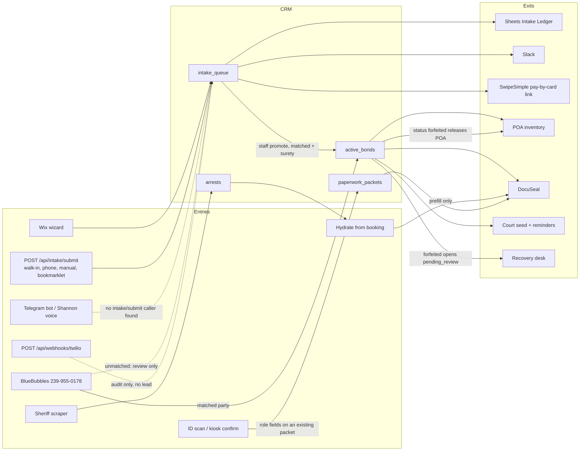

# Bond workflow endpoint map

Audit date: 2026-10-07. Repo: `shamrock-leads` (CRM at `https://leads.shamrockbailbonds.biz`).

Every row is one entry or the handoff it is supposed to reach. Status:

| Status | Count | Meaning |
|--------|------:|---------|
| OK | 7 | Already wired. A contract test or an existing CI test covers the fail-closed behavior. |
| fixed | 10 | Broken handoff corrected in this change. |
| gap | 5 | Needs an owner decision. Not guessed. |

Counts are the Entry and Exit tables below (one status per row). Background jobs are not in the count.

Contract tests: `tests/test_workflow_endpoints.py` (fakes only; no live Twilio, ElevenLabs, DocuSeal, SwipeSimple, Slack, Sheets, or BlueBubbles).

Solid arrows are wired. Dotted arrows are gaps.

## Entries

| Entry | Trigger | Auth | Writes | Next step | Status |
|-------|---------|------|--------|-----------|--------|
| Wix website application, including an indemnitor starting a bond | `POST /api/webhooks/wix-intake` | `X-Wix-Webhook-Secret` (`WIX_WEBHOOK_SECRET`, else `GAS_API_KEY`). 503 if unset, 401 if wrong | `intake_queue`, redacted `audit_events` | Auto-match, then `intake_fanout` (Sheets + Slack). Response includes `payment_link`. Staff promote after a validated match | OK |
| Wix portal payload on the shared intake route | `POST /api/intake/submit` with a `wix*` source | Same secret. Previously allowed the write when the secret was unset | `intake_queue` (secret keys stripped from `_raw`) | Same fan-out and pay-by-card link as the webhook | fixed |
| Telegram bot and Telegram mini-apps | CRM accepts `POST /api/intake/submit` with `telegram` or `telegram_mini_app` (staff session or `GAS_API_KEY` / `LEADS_INTERNAL_TOKEN`). A search of `shamrock-telegram-app` found no caller of that route | Not a public form | Nothing from the bot today. Staff can still post the source from `dashboard/sl-intake.js` | The bot does not open an intake. See the caller list under owner decision 3 | gap |
| Walk-in, manual, phone, dashboard | `POST /api/intake/submit` | Staff PIN (machine key also passes the middleware) | `intake_queue`. County, state, DL state, and surety are left blank when the payload omits them | Sheets, Slack, website pay-by-card link. Empty body or no name/phone/booking returns 400 | fixed |
| Bookmarklet from a sheriff or clerk page | `POST /api/intake/submit` source `bookmarklet` | Staff PIN | `intake_queue` | Same fan-out and website pay link. County is taken from the payload only | fixed |
| Shannon voice, 727-295-2245 | Netlify `shamrock-telegram.netlify.app/api/twilio-voice`. This CRM does not receive a lead from that URL | Health probe only (`GET /api/ops/shannon-health`). Texts go to `POST /api/imessage/shannon/send` (BlueBubbles). Paperwork and ID go to `/api/paperwork/shannon/*` | No `intake_queue` row from the voice app. The only named intake caller outside this repo is `backend-gas/Shannon_PaperworkTools.js` | Voice does not land in the intake queue from the Telegram app. See owner decision 3 | gap |
| Desktop, mobile, or tablet ID / license scan | `POST /api/id/scan-ocr` and `POST /api/indemnitors/scan-id` | Staff PIN | Nothing on the lead. A `booking_number` may upload the image to the bond's Drive folder | OCR fields return to the staff form. That form is what calls `/api/intake/submit`. Empty upload is 400 | OK |
| Lobby kiosk ID | `POST /api/portal/kiosk-id-ocr` then `POST /api/portal/kiosk-id-confirm` | Portal prefix is open. Confirm requires a signed `scan_token` (`SECRET_KEY`) | Confirm writes that role's fields on `paperwork_packets` (and the indemnitor row when the packet already has `indemnitor_id`) | DocuSeal submitter update for that role only. Bad token 400, expired token 410. A scan never creates a new lead | OK |
| Sheriff / clerk scrapers | Scheduler and `python main.py <county>` | Process env | `arrests` (scored). This audit did not change scraper health or source contracts | Staff one-click hydrate. A scrape is not a bond | OK |
| One-click hydrate from a scraped defendant | `POST /api/paperwork/hydrate-from-booking` | Staff PIN | None. Read-only prefill | 400 without a booking number. 404 when no defendant name exists. 409 when two arrests share the booking. Surety stays unset until staff pick one. Send still requires a POA | OK |
| Texts on 239-955-0178 | `POST /api/webhooks/bluebubbles` (`new-message`) | Open receiver. A present `x-bb-signature` is checked when `BB_WEBHOOK_SECRET` is set | `imessage_outreach`. Consent keywords hit `sms_consent_ledger` | Matched numbers attach to the existing bond, prospective, or intake and do not auto-reply when the match is ambiguous. Unmatched texts stay `status: unmatched` for staff. They do not open an intake | gap |
| `POST /api/webhooks/twilio` | Twilio form POST | `TWILIO_AUTH_TOKEN` signature in production | `audit_events` (`inbound_sms`) and an SSE `sms_received` | Stops. Does not create an intake, bond, or payment link. This is not Shannon and not the texting line | gap |

`shamrock-telegram-app` is not this repository and was not edited. A search of that app found no call to `/api/intake/submit`. The only hit for that path outside this repo is `backend-gas/Shannon_PaperworkTools.js`. What this CRM actually serves for Telegram and Shannon is listed under owner decision 3. A browser mini-app cannot hold `GAS_API_KEY`; production returns 401 without a staff session or machine key.

`POST /api/write-bond` returns 410. New paperwork is the DocuSeal path (`/api/paperwork/docuseal/...`, `/api/paperwork/write-bond-forward/execute`).

## Exits

| Exit | How a lead reaches it | Collections | Status |
|------|------------------------|-------------|--------|
| CRM lead | Every row in Entries that returns `success: true` from intake submit or the Wix webhook | `intake_queue` | fixed |
| BondCase | `POST /api/intake/{id}/promote` after a validated `matched_booking_number`, an active surety, a bond amount greater than $0, and a POA whose `max_bond_value` covers that amount | `active_bonds` (`source: intake_promotion`), intake `status: promoted`, `audit_events`. Blank or $0 returns 422 and assigns no power | fixed |
| Google Sheets daily ledger | `intake_fanout` reloads the intake after match, then enqueues. Cron `intake_fanout_retry` every 5 minutes | `intake_fanout_outbox` target `sheets`. GAS action `appendIntakeLedger`. A matched row includes status, county, state, strategy, and timestamp | fixed |
| Slack notification | Same outbox, target `slack`. Headline names the source (website, Telegram, walk-in, Shannon, …) | Webhook `SLACK_WEBHOOK_INTAKE`, else `SLACK_WEBHOOK_LEADS` | fixed |
| Pay-by-card option | `payment_link` on the intake response. A case's own SwipeSimple invoice wins. Otherwise Telegram uses the Telegram link and every other source uses the website link | None until a later send | fixed |
| SwipeSimple invoicing send | Promote calls the share-invoice hook only when `SWIPESIMPLE_SHARE_INVOICE_ON_PROMOTE=1`, and that hook passes `dispatch=False`. Live customer send still needs `SWIPESIMPLE_DISPATCH_LIVE` | `payments` / invoice fields when a staff send runs | gap |
| Write Bond → DocuSeal | Staff hydrate, then packet finalize / `write-bond-forward/execute`. Completion webhook `POST /api/webhooks/docuseal` | `paperwork_packets` | OK |
| POA / powers | Promote takes the smallest available power that covers a bond amount greater than $0. Blank or $0 is refused and no power is allocated. An undersized power is not a fallback. Forfeiture, exoneration, and surrender call `auto_release_poa` | `poa_inventory` | fixed |
| Court-date reminders and check-ins | Promote, bond record, and DocuSeal completion call `seed_court_calendar_for_bond`. Cron `court_reminders` sends what was scheduled. Check-in links are staff actions (`/api/active-bonds/{booking}/send-checkin-link`, `/api/checkin/submit`) | `court_reminders`, `gcal_sync`, `bond_checkins` | OK |
| Recovery / forfeiture | `PATCH /api/active-bonds/{booking}/status` with `forfeited` goes through `BondStateMachine`: audit, POA release, cancel pending tasks, then `queue_forfeiture_review` | `active_bonds`, `audit_events`, `recovery_case_shares` with `status: pending_review`. Staff confirm with the existing share action, which promotes that row to `active`. No outbound message. Exoneration and surrender do not open one | fixed |

## Background jobs on this chain

| Job | Interval | Handoff | Status |
|-----|----------|---------|--------|
| `intake_fanout_retry` | 5 min | Retries Sheets and Slack outbox rows | OK |
| `matching_backlog` | 1 h | Re-runs match on unmatched intakes. Does not promote | OK |
| `court_reminders` | 1 h | Sends reminders already seeded | OK |
| `court_email` | 15 min | Gmail court mail → calendar / reminders | OK |
| `docuseal_poller` | 30 min | Signing status when the webhook was missed | OK |
| `swipesimple_gmail_poll` | 5 min | Receipt mail. Does not create a lead | OK |
| `forfeiture_scan` | 4 h | Scores risk and opens a review task. Does not forfeit the bond or open recovery | OK |
| `fta_alert` | 4 h | Staff alert. Can also notify Telegram staff chats | OK |
| `paperwork_chase` | 1 h | Chase unsigned packets. Send gates stay in the signature policy | OK |
| `intake_recovery` | 1 h | Staff follow-up on stalled intakes. Not the recovery desk | OK |
| `rearrest_detection` | 2 h | New arrests vs active bonds | OK |
| `lee_clerk_watch` | 15 min | Lee clerk posted-bond watch. Does not change source contracts | OK |

## Owner decisions (the gaps)

1. **Unmatched BlueBubbles texts.** A text from a number that is not already on a bond or intake is stored for staff review and does not become a lead, a Sheets row, or a pay link. Auto-creating an intake from every inbound text would also capture spam. Say if staff should have a one-click "make intake" action, or if a keyword should open one.
2. **`POST /api/webhooks/twilio`.** Shannon's calls are answered by the Netlify voice app, and texts are BlueBubbles. This CRM route only audits an inbound SMS-shaped form and returns empty TwiML. Say if the route should stay as a signed sink, or be removed so a mis-pointed Twilio number cannot land here.
3. **Telegram and Shannon do not post intakes from `shamrock-telegram-app`.** A code search of that repo found no call to `/api/intake/submit`. The only hit for that path is `backend-gas/Shannon_PaperworkTools.js` (not edited here). Callers that exist today:
   - Staff desk: `dashboard/sl-intake.js` posts `POST /api/intake/submit` (a person can choose `telegram`, `elevenlabs_voice`, or `shannon` on that form).
   - Shannon texts: `POST /api/imessage/shannon/send` (BlueBubbles on 239-955-0178, not Twilio).
   - Shannon paperwork: `POST /api/paperwork/shannon/email`.
   - Shannon ID: `POST /api/paperwork/shannon/id-link`, `POST /api/paperwork/shannon/id/{token}`, `POST /api/paperwork/shannon/id-status`, and `GET /paperwork/shannon/id/{token}`.
   - Voice health only: `GET /api/ops/shannon-health` probes `https://shamrock-telegram.netlify.app/api/twilio-voice` (unsigned POST should be 403) and `/api/twilio-voice-fallback` (200 with the desk, office, and Shannon numbers). That probe does not create an intake.
4. **SwipeSimple send stays off.** Every source now *offers* the same pay-by-card link. Creating and texting an invoice is still gated (`SWIPESIMPLE_SHARE_INVOICE_ON_PROMOTE`, `SWIPESIMPLE_DISPATCH_LIVE`) and promote never dispatches. Turn those on only with the production checklist.

Decisions 5 and 6 are implemented. Forfeiture still releases the POA and now opens one `recovery_case_shares` row at `pending_review` (staff confirm; no outbound message). Promote with a blank or `$0` bond amount returns 422 and allocates no power.

## Env vars this chain reads

These were missing from `AGENTS.md` and are listed there now: `WIX_WEBHOOK_SECRET`, `GAS_WEB_APP_URL`, `GAS_API_KEY`, `SLACK_WEBHOOK_INTAKE`, `INTAKE_FANOUT_DISABLED`, `SWIPESIMPLE_LINK_DEFAULT`, `SWIPESIMPLE_LINK_TELEGRAM`, `SWIPESIMPLE_WEBHOOK_SECRET`, `BB_WEBHOOK_PUBLIC_URL`, `BB_WEBHOOK_SECRET`, `TWILIO_WEBHOOK_PUBLIC_URL`.
