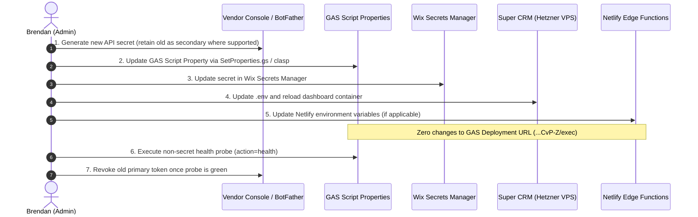

# C3 Historical Secret Rotation Approval Package & Impact Analysis

> **Target Checklist Item:** [`ECOSYSTEM_PROD_CHECKLIST.md`](../ECOSYSTEM_PROD_CHECKLIST.md) §C3 (Secret rotation complete if any keys ever lived in git)  
> **Status:** 🔲 **Human-Gated — Open** (Awaiting Brendan's explicit vendor-by-vendor approval)  
> **Security Directive:** **No credentials will be modified, revoked, generated, revealed, or committed during this analysis.** All historical exposures are referenced solely by file path and commit hash.

---

## 1. Executive Summary & Ecosystem Boundaries

Historical audit identified that early development iterations contained hardcoded API tokens in tracked repository setup scripts. These keys were scrubbed in commit `969cf71` and subsequent refactors (`c726d9b`, `6fae72c`). While the repositories are private, industry standard and SOC2 compliance require rotating all historically exposed credentials.

### Non-Negotiable Operating Rules for Rotation:
1. **GAS Web App URL is Invariant:** Rotation must **never** create a new Google Apps Script deployment URL. The existing stable production `/exec` URL (`...CvP-Z/exec`) remains fixed.
2. **Same-Window Synchronization:** Cross-system credentials (e.g. `GAS_API_KEY` between GAS, Wix, Super CRM, and Node-RED) must be rotated in a single synchronized window to prevent service disruption.
3. **Fail-Closed Verification:** Each rotated credential is verified using safe HTTP status probes and non-PII transaction logs. Zero raw keys are printed to chat, terminal, or logs.
4. **Independent Vendor Control:** Brendan can approve, defer, or decline each vendor rotation independently based on business priorities.

---

## 2. Comprehensive Credential Inventory & Impact Matrix

| # | Credential Name | Historical Exposure Evidence | Vendor / Owner | Dependent Shamrock Surfaces | Prescribed Rotation Order | Rollback Strategy | Non-Secret Verification Method | Downtime / Impact Risk | Mandatory Human Access |
|---|---|---|---|---|---|---|---|---|---|
| **1** | `GAS_API_KEY` / `WIX_API_KEY` | `backend-gas/Code.js` (`969cf71`, `c726d9b`) | Google Workspace / Internal | • Central GAS Script Properties<br>• Wix Secrets Manager<br>• Super CRM VPS `.env`<br>• Node-RED flow credentials | **Batch 1 (Core Bridge)**<br>1. Gen new key<br>2. Update GAS<br>3. Update Wix Secrets<br>4. Update VPS `.env`<br>5. Update Node-RED | Restore prior `GAS_API_KEY` in GAS Script Properties and Wix Secrets | `curl -sS "GAS_URL?action=health&apiKey=..."` returns `200` (`version: V409`) | Low (brief ~15s bridge sync window) | • Google Apps Script Editor<br>• Wix Secrets Manager<br>• VPS SSH |
| **2** | `WIX_WEBHOOK_SECRET` | `backend-gas/SetupUtilities.js` (`969cf71`) | Wix Velo / Internal | • Central GAS Script Properties<br>• Wix Secrets Manager<br>• Super CRM VPS `.env` | **Batch 1 (Core Bridge)**<br>Update concurrently with `GAS_API_KEY` | Revert secret in Wix Secrets and GAS Properties | Super CRM `/health` reports `wix_webhook_auth: true` | Low (intake ingestion during update) | • Wix Secrets Manager<br>• GAS Editor |
| **3** | `ELEVENLABS_API_KEY` & `ELEVENLABS_TOOL_SECRET` | `backend-gas/SetupUtilities.js`, `Test_PrincipalEngineer.js` (`969cf71`) | ElevenLabs Console | • ElevenLabs Agent UI<br>• Netlify Edge Function env<br>• Central GAS Script Properties | **Batch 2 (Voice Stack)**<br>1. Rotate in ElevenLabs<br>2. Update Netlify env<br>3. Update GAS Properties | Restore prior API key in Netlify and GAS | Netlify Edge Function health probe returns `200` | Medium (after-hours phone intake voice agent) | • ElevenLabs Console<br>• Netlify Console<br>• GAS Editor |
| **4** | `TELEGRAM_WEBHOOK_SECRET` / `TELEGRAM_BOT_TOKEN` | `backend-gas/Test_PrincipalEngineer.js` (`969cf71`) | Telegram BotFather | • Telegram Bot (`@ShamrockBail_bot`)<br>• Central GAS Script Properties<br>• Wix Secrets Manager | **Batch 3 (Messaging)**<br>1. Gen token in BotFather<br>2. Update GAS & Wix<br>3. Re-set Telegram webhook | Revert webhook via BotFather API to prior token | Telegram `/getMe` and test inline bot query | Low (Telegram bot interaction) | • Telegram BotFather<br>• GAS Editor |
| **5** | `MEMO_API_KEY` (Mem0 / Shannon Memory) | `backend-gas/Test_PrincipalEngineer.js` (`969cf71`) | Mem0.ai / Platform | • Central GAS Script Properties<br>• Super CRM VPS `.env` | **Batch 4 (AI Memory)**<br>1. Rotate in Mem0 dashboard<br>2. Update GAS & VPS | Restore prior key in GAS Properties | Shannon memory context lookup unit test | Low (caller memory retention only) | • Mem0.ai Dashboard<br>• GAS Editor |
| **6** | `TWILIO_AUTH_TOKEN` | `backend-gas/SetProperties.gs` (historical) | Twilio Console | • Twilio Console<br>• Central GAS Script Properties<br>• Super CRM VPS `.env`<br>• Netlify env | **Batch 5 (Telephony)**<br>1. Request Secondary Token<br>2. Update GAS, VPS, Netlify<br>3. Promote Secondary to Primary | Demote secondary / keep primary active during test | Twilio SMS balance and API ping probe | Low (zero-downtime dual-token promotion) | • Twilio Console<br>• GAS Editor<br>• VPS SSH |
| **7** | `GOOGLE_MAPS_API_KEY` | `backend-gas/SetProperties.gs` (historical) | Google Cloud Console | • Central GAS Script Properties<br>• Frontend Dashboard Map Embeds | **Batch 6 (GCP)**<br>1. Gen key with HTTP Referrer restriction<br>2. Update GAS<br>3. Delete old key | Roll back to prior key in Cloud Console | Load Dashboard map component without JS console errors | None (dual key validity in GCP) | • GCP Console (`shamrock-bail-bonds`) |
| **8** | `SLACK_BOT_TOKEN` & Webhooks | `ScriptProperties_Temp.js` (gitignored, scrubbed) | Slack API Console | • Central GAS Script Properties<br>• Super CRM VPS `.env`<br>• Node-RED flows | **Batch 7 (Alerts)**<br>1. Reinstall Slack app<br>2. Update Webhook URLs<br>3. Update GAS & VPS | Keep old webhooks active until new ones verified | Trigger test alert to `#signing-errors` | None (internal ops alerts only) | • Slack App Management Console |
| **9** | `WIX_CLI_API_KEY` (GitHub Actions Deploy) | `SECRETS_ROTATION_GUIDE.md` §5 | Wix Account Management | • GitHub Actions Secrets (`shamrock-bail-portal-site`) | **Batch 8 (CI/CD)**<br>1. Gen key at manage.wix.com<br>2. Update GitHub secret | Revert GitHub secret if deployment fails | Run manual GitHub Action `wix-deploy.yml` | None (CI/CD deploy pipeline only) | • Wix Account Console<br>• GitHub Repo Admin |
| **10** | `SIGNNOW_API_TOKEN` | `backend-gas/SetProperties.gs` (historical) | SignNow | • Central GAS (Retired)<br>• Super CRM (Retired) | **Batch 9 (Decommission)**<br>Revoke old token in SignNow | N/A (DocuSeal is sole active signing provider) | Verify legacy route returns `410` / `LEGACY_DIRECT_PAPERWORK_DISABLED` | None (SignNow is completely retired) | • SignNow Developer Console |

---

## 3. Brendan's Approval Checklist

Please review and select the desired action (**Approve**, **Defer**, or **Decline**) for each credential class:

```text
[ ] BATCH 1: Core Bridge (GAS_API_KEY, WIX_API_KEY, WIX_WEBHOOK_SECRET)
    Decision: [  ] APPROVE    [  ] DEFER    [  ] DECLINE
    Notes: Requires synchronized update across GAS, Wix Secrets, and Super CRM.

[ ] BATCH 2: Voice Stack (ELEVENLABS_API_KEY, ELEVENLABS_TOOL_SECRET)
    Decision: [  ] APPROVE    [  ] DEFER    [  ] DECLINE
    Notes: Requires ElevenLabs Console + Netlify environment update.

[ ] BATCH 3: Telegram Bot (TELEGRAM_BOT_TOKEN, TELEGRAM_WEBHOOK_SECRET)
    Decision: [  ] APPROVE    [  ] DEFER    [  ] DECLINE
    Notes: Requires BotFather token regeneration and webhook reset.

[ ] BATCH 4: Mem0 AI Memory (MEMO_API_KEY)
    Decision: [  ] APPROVE    [  ] DEFER    [  ] DECLINE
    Notes: Low risk; updates long-term conversation storage.

[ ] BATCH 5: Twilio Telephony (TWILIO_AUTH_TOKEN)
    Decision: [  ] APPROVE    [  ] DEFER    [  ] DECLINE
    Notes: Zero-downtime dual-token promotion via Twilio Console.

[ ] BATCH 6: Google Maps API (GOOGLE_MAPS_API_KEY)
    Decision: [  ] APPROVE    [  ] DEFER    [  ] DECLINE
    Notes: Restricted by HTTP referrer to *.shamrockbailbonds.biz.

[ ] BATCH 7: Slack Bot & Webhooks (SLACK_BOT_TOKEN, SLACK_WEBHOOK_*)
    Decision: [  ] APPROVE    [  ] DEFER    [  ] DECLINE
    Notes: Internal notification channels.

[ ] BATCH 8: Wix CLI Deploy Key (WIX_CLI_API_KEY)
    Decision: [  ] APPROVE    [  ] DEFER    [  ] DECLINE
    Notes: GitHub Actions secret for portal publishing.

[ ] BATCH 9: SignNow Revocation (SIGNNOW_API_TOKEN)
    Decision: [  ] APPROVE    [  ] DEFER    [  ] DECLINE
    Notes: Permanent revocation of legacy signing token.
```

---

## 4. Same-Window Synchronized Execution Plan

When an approved batch is authorized, execution proceeds through four controlled stages:



---

## 5. Redacted Post-Rotation Verification Matrix

Every rotation must be validated using the following non-secret verification methods:

| Credential / System | Verification Command / Endpoint | Expected Non-Secret Output | Pass / Fail Condition |
|---|---|---|---|
| **Central GAS Factory** | `curl -sS "GAS_URL?action=health&apiKey=<NEW_KEY>"` | `{"success": true, "version": "V409"}` | HTTP 200 & version string matches |
| **Super CRM Invariant** | `python3 scripts/check_ecosystem_secrets.py --strict` | `0 critical gaps` | Exit code 0 |
| **Super CRM Health** | `curl -sS "https://leads.shamrockbailbonds.biz/health"` | `{"status": "healthy", "secret_key": true}` | HTTP 200 & healthy status |
| **Netlify Edge Proxy** | `curl -sS -I "https://shamrock-telegram.netlify.app/api/gas-proxy"` | `HTTP/2 200` or expected method response | SSL valid, upstream reachable |
| **Telegram Bot** | Send `/start` to `@ShamrockBail_bot` in Telegram | Standard welcome card with menu buttons | Immediate reply from active webhook |
| **Wix Deploy CI/CD** | Trigger `wix-deploy.yml` workflow in GitHub Actions | `Workflow run completed: Success` | Site published with exit code 0 |

---

## 6. Checklist Status

- **C3 (`SECRETS_ROTATION_GUIDE.md` rotation):** 🔲 **Remains OPEN** until Brendan reviews this approval package, authorizes the rotation batches, and post-rotation verification is completed.
